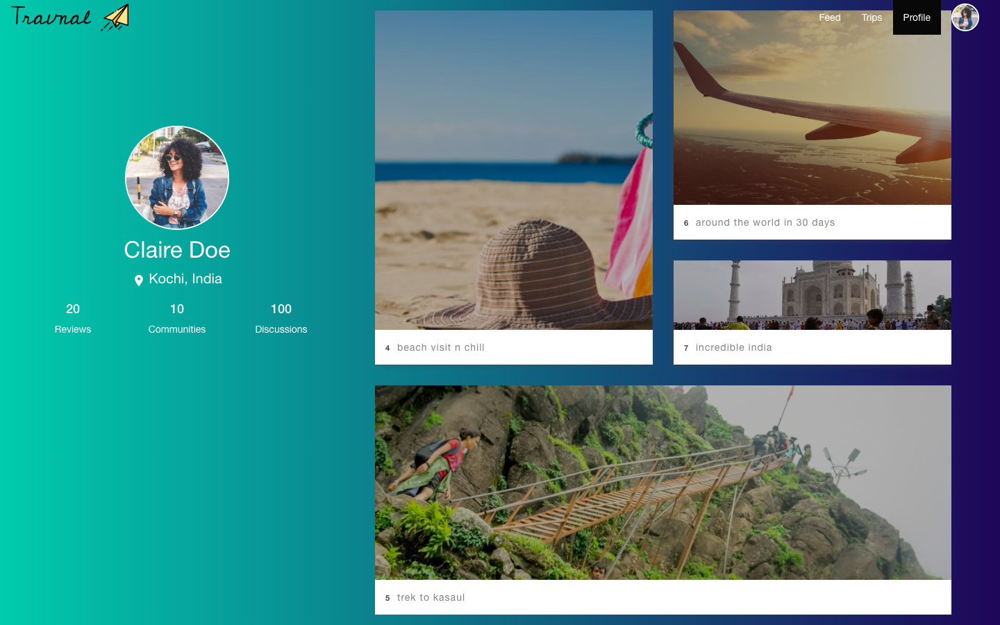

<p align="center">
  <a href="" rel="noopener">
 </a>
</p>

<h3 align="center">Travnal</h3>
<h6 align="center">Trav(el Jour)nal</h6>

<div align="center">


</div>

------------------------------------------

>Social Media and travellers are something that goes a long way together. So rather than travellers adjusting their content for social media.We decided to build social media tailor made for their needs.


<div align="center">
&#10077; Take only memories, leave only footprints &#10078
</div>


------------------------------------------
### Features

- Create your own trips
- Clean and Sweet timeline view of trips
- Mark your location real time and express what you feel like
- Browse across your feeds
- Search for required locations and trips others have made
- Follow people, get followed by other

------------------------------------------
<div align="center">

<h3 > Travnal Web-App  </h3>
<br>
<p align="center">




</p>

</div>

------------------------------------------
### Installation

* Install dependencies
```sh
        $ npm install
```

* Start mongodb server
```sh
        $ mongod --dbpath [wherever you put your data folder]
```

* Start server
```sh
        $ npm start
```

* Start your browser you are ready to go 

------------------------------------------
### Contributing

 We're are open to `enhancements` & `bug-fixes` :smile:

------------------------------------------
### Note

- This project was done as a part of Web Technology Lab Mini-Project for 5th semester.
- All the three people involved had no prior knowledge of working with node.js environment

------------------------------------------
### Contributors

- [@nurdtechie98](https://github.com/shivam1708)
- [@raj-vora](https://github.com/raj-vora)
- [@aniketp319](https://github.com/aniketp319)

